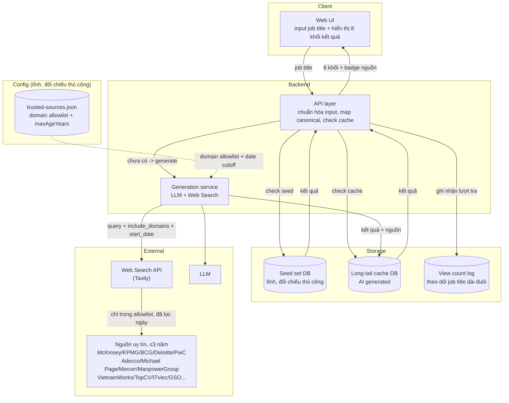
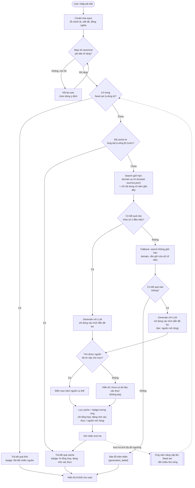

# Career Job Lookup Tool — Design Spec

Ngày: 2026-09-16
Trạng thái: Đã thống nhất qua brainstorm, chờ duyệt trước khi viết implementation plan.

## 1. Vấn đề / Mục tiêu

Người trẻ Việt Nam (học sinh, sinh viên, mới ra trường) đang tìm hiểu sự nghiệp thường
không hình dung được một nghề cụ thể thực sự làm gì, cần gì, và cơ hội ra sao — nên khó
quyết định có nên theo đuổi hay không.

Mục tiêu: nhập 1 job title → nhận kết quả có cấu trúc, đủ để dẫn tới **hành động cụ thể**
(nên học gì, ưu tiên kỹ năng nào), không dừng ở việc "biết thêm thông tin" thuần túy.

## 2. Đối tượng & bối cảnh sử dụng

- **Đối tượng chính:** người trẻ mới tìm hiểu sự nghiệp (học sinh, sinh viên, mới ra
  trường) — chưa đi làm hoặc mới bắt đầu.
- **Bối cảnh dùng:** cả hai trường hợp đều phổ biến, không tách luồng riêng ở v1:
  - Tò mò về đúng 1 nghề cụ thể, chưa có nghề khác để so sánh.
  - Đang phân vân giữa vài nghề, tra từng cái để tự cân đo trong đầu.

## 3. Value proposition & USP (framing trung thực)

**Value:** trả lời nhanh, đầy đủ, có cấu trúc nhất quán mà không đòi hỏi người dùng biết
cách "prompt" AI giỏi; mọi số liệu đều minh bạch nguồn gốc.

**USP — đây là execution/UX moat, KHÔNG PHẢI data moat:**
- Luôn trả đủ 8 mục nội dung, luôn có nguồn kèm theo — ChatGPT/Gemini làm được nhưng
  không nhất quán, phụ thuộc vào cách hỏi của từng người.
- Kiến trúc thông tin (career path theo giai đoạn, so sánh ngành dễ nhầm lẫn) hợp UI
  trực quan hơn hẳn văn xuôi chat.
- Curation nguồn đúng ngữ cảnh VN, không phụ thuộc kết quả search ngẫu nhiên.

Đây không phải lợi thế bất khả xâm phạm — là điểm khởi đầu khả thi cho quy mô solo/
part-time, để ngỏ đường nâng cấp lên data moat thật (xem mục 8) khi đã có traction.

## 4. Cấu trúc nội dung — 8 khối mỗi job title

1. **Mô tả nghề** — nghề này làm gì, làm việc với ai, sản phẩm/kết quả công việc.
2. **Thị trường VN** — quy mô nhu cầu, ngành/công ty tuyển nhiều, xu hướng tăng/giảm.
3. **Mức lương** — theo từng giai đoạn career path (khớp mục 8), kèm nguồn + năm.
4. **Nhu cầu tuyển dụng** — mức độ cạnh tranh, nguồn trích dẫn.
5. **Ngành dễ nhầm lẫn** — 2-3 nghề gần giống, mỗi cái 1 câu phân biệt.
6. **Hard skill & Soft skill** — danh sách kèm mô tả lý do cần.
7. **Skill tương lai** — xu hướng skill ngành sẽ tăng/giảm, kèm nguồn dự báo.
8. **Career path** — các giai đoạn (Fresher → Junior → Senior → Lead...), mỗi giai đoạn:
   skill trọng tâm + lương tham khảo + thời gian trung bình lên giai đoạn kế.

**Nguyên tắc bắt buộc:** mọi số liệu (lương, nhu cầu, xu hướng) có trường "nguồn" đi kèm.
Không có nguồn đủ tin cậy → hiển thị rõ "chưa có dữ liệu xác thực", không để AI bịa cho đủ.

## 5. Chiến lược nguồn dữ liệu — Option C+

**Luồng A — Seed set (~30-50 job title phổ biến nhất):**
Đối chiếu thủ công 1 lần với nguồn uy tín cố định (GSO, report Adecco/Michael Page/
Mercer/ManpowerGroup, tác giả/chuyên gia HR có tên tuổi ở VN). Lưu tĩnh, badge
**"Đã đối chiếu nguồn"**. Không generate lại mỗi lượt tra.

**Luồng B — Long-tail (job title ngoài seed set):**
AI generate on-demand kèm web search để tìm nguồn trích dẫn được. Cache kết quả,
badge **"AI tổng hợp, đang chờ xác thực"**.

Web search cho Luồng B **ưu tiên** danh sách domain uy tín cố định (`data/trusted-sources.json`):
công ty tư vấn chiến lược lớn (McKinsey, KPMG, BCG, Deloitte, PwC) cho xu hướng thị
trường/ngành, và công ty tuyển dụng/nhân sự (Adecco, Michael Page, Mercer, ManpowerGroup,
Robert Walters, Hays, VietnamWorks, TopCV, ITviec, Indeed, GSO) cho số liệu lương cụ thể —
cộng lọc chỉ lấy nội dung xuất bản trong 3 năm gần đây, badge **"AI tổng hợp, đang chờ xác
thực"**.

Nếu danh sách domain uy tín không có kết quả nào (nghề quá ngách/lạ), hệ thống **fallback
sang tìm kiếm không giới hạn domain** (vẫn giữ cửa sổ 3 năm) để mọi job title đều tra ra
được kết quả đầy đủ, thay vì báo lỗi ngay — kết quả loại này gắn badge riêng **"AI tổng
hợp, nguồn mở rộng"** để user biết độ tin cậy thấp hơn tier domain uy tín. Chỉ khi cả 2 lượt
tìm kiếm (uy tín rồi mở rộng) đều rỗng mới trả lỗi thân thiện — không có trường hợp nào bịa
số liệu.

**Vòng lặp tự cải thiện:** long-tail job title được tra đủ nhiều lượt → trở thành ứng viên
để đối chiếu thủ công, nâng cấp lên seed set. Seed set lớn dần theo nhu cầu thật.

## 6. Luồng dữ liệu

1. Chuẩn hóa input — xử lý lỗi chính tả, viết tắt, đồng nghĩa.
2. Map về job title chuẩn (canonical). Nếu mơ hồ (VD "BA" = Business Analyst hay
   Backend Developer?) → hỏi lại user chọn trước khi tra, không đoán bừa.
3. Check cache/seed set:
   - Có → trả kết quả ngay.
   - Chưa có → generate qua Luồng B, cache lại, ghi nhận lượt tra để tích lũy tín hiệu
     nâng cấp lên seed set.
4. Hiển thị 8 khối kèm nhãn nguồn/badge tương ứng.

**Xử lý lỗi:**
- Input không phải nghề thật/không nhận diện được → không generate bừa, gợi ý job
  title phổ biến gần giống.
- AI/search generate thất bại → thông báo lỗi thân thiện, không hiển thị nội dung rỗng
  giả vờ là kết quả.

**Kiến trúc:** không cần crawler/queue chạy nền liên tục — chỉ 1 luồng generate-on-demand
+ cache, cộng 1 bảng dữ liệu tĩnh cho seed set cập nhật tay theo lịch. Phù hợp vận hành
solo/part-time.

## 7. Success metrics (v1)

Không đo lượt tra cứu thô (vanity metric). Theo dõi thay vào đó:
- % session người dùng xem/scroll tới khối career path (proxy cho "tìm thấy hành động
  cụ thể để làm tiếp", đúng mục tiêu đã đặt ở mục 1).
- % người dùng quay lại trong 30 ngày (đặc biệt để tra thêm job title thứ 2/3 — tín hiệu
  sản phẩm được dùng cho việc so sánh thật).
- Số job title long-tail đạt ngưỡng lượt tra đủ để trở thành ứng viên nâng cấp seed set
  (tín hiệu content pipeline đang hoạt động và bám đúng nhu cầu thật).

## 8. Ngoài phạm vi v1 (parked, không phải bỏ hẳn)

- Cá nhân hóa theo profile/skill hiện có của từng user (quiz-based gap analysis).
- Crawl JD tuyển dụng trực tiếp (TopCV/VietnamWorks/nguồn khác) — xem spike findings
  bên dưới, rủi ro cao so với lợi ích ở giai đoạn này.
- Crowdsource lương/skill từ chính người dùng — audience v1 (trẻ, mới tìm hiểu) không
  phải tập có sẵn dữ liệu thật để cho; cần cơ chế bắt đúng mốc chuyển tiếp (mới nhận
  offer/mới đi làm) hoặc mời người đi trước — để dành khi đã có traction.
- B2B dashboard / hướng thu phí tổ chức — để dành cho giai đoạn có traction, không phải
  việc của v1 (không đủ nguồn lực solo/part-time để vừa build vừa sales).

## 9. Spike findings (đã kiểm chứng thực tế 2026-09-15, tham khảo khi cân nhắc mở rộng)

| Nguồn | Kết quả | Ghi chú |
|---|---|---|
| TopCV | ❌ 403 chặn bot tầng network | robots.txt cho phép nhưng có bot-protection riêng |
| VietnamWorks | ⚠️ Cần headless browser | Nội dung render bằng JS, fetch tĩnh không đọc được |
| ITviec | ✅ Crawl tĩnh thành công | Skill data tốt, nhưng lương ẩn sau login, phạm vi chỉ Tech/IT |
| CareerBuilder.vn | ❌ Lỗi SSL | Nghi vấn site không được maintain tốt |
| Vieclam24h.vn | ❌ Chặn ngay từ robots.txt | — |
| CareerLink.vn | 🚫 Cấm đích danh AI bot trong robots.txt | Ranh giới đạo đức — không nên crawl dù kỹ thuật vượt được |
| GitHub repo "linkedin-job-scraper" | 🚫 Dấu hiệu malware cao | Không có source code, file zip lạ, không nên dùng |

## 10. Ràng buộc

- Xây bởi 1 người, ngoài giờ (side project) — mọi quyết định thiết kế ở trên ưu tiên
  phương án khả thi solo/part-time, tránh rủi ro pháp lý/kỹ thuật cao, tránh phụ thuộc
  cơ chế cần nhiều người dùng đóng góp ngay từ đầu.

## 11. Diagrams

### 11.1 Architecture diagram

### 11.2 Logic lấy thông tin (research flow)

